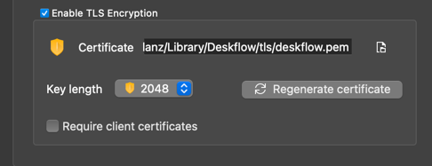

# Deskflow Android

A **near** fully functional Deskflow client for Android devices.

## Table of Contents

<!-- TOC -->
* [Deskflow Android](#deskflow-android)
  * [Table of Contents](#table-of-contents)
  * [Features & Limitations](#features--limitations)
  * [Installation](#installation)
    * [Google Play](#google-play)
    * [Build manually](#build-manually)
  * [Config](#config-)
    * [Deskflow Server](#deskflow-server)
      * [TLS/SSL Security](#tlsssl-security)
    * [Deskflow Android (this app)](#deskflow-android-this-app)
      * [Setup Connection](#setup-connection)
      * [Keyboard (IME)](#keyboard-ime-)
      * [Start/Stop Connection](#startstop-connection)
<!-- TOC -->

## Features & Limitations

- Shortcuts & Hotkeys  
  - App Switching (`Command+Tab` or `Alt+Tab`)
  - Arrow keys for general navigation
  - `Escape` for `Back` functionality
  - +++
- Clipboard integration
  - Text (of any kind) is supported
  - __Bitmap is **NOT** supported currently, but is next on the list__
- Simple gesture support 
  - Pull down on the status bar
  - Pull up for all apps, etc
- **Content Scrolling is not functional with gestures or click & drag, BUT arrow keys in many apps will work.**
- **IMPORTANT: TLS is Supported, but individual client certificates are not.**  

## Installation


### Google Play

Coming soon

### Build manually

1. Clone the repository:  
   ```bash
   git clone git@github.com:jglanz/deskflow android.git
   ```

## Config 

### Deskflow Server

The only potential configuration change required by the Deskflow Android client, 
is the TLS configuration, described below.

#### TLS/SSL Security

TLS is supported, but individual client certificates are not.

> **IMPORTANT**: TLS is Supported, but individual client certificates are not as shown in the screenshot below.



### Deskflow Android (this app)

On first launch, you'll see a gear in the top right corner of the app,
press the gear (highlighted in the screenshot below) to open the configuration screen.


#### Setup Connection

The only configuration information required is:


- `Screen Name` the name you configured in the Deskflow Server.
- `Host` & `Port` of your Deskflow Server.
- `Use TLS` if your Deskflow Server is configured for TLS.

Press `Save` to save your configuration and return to the home screen.

> NOTE: As soon as you press `Save`, the app will attempt to connect to the Deskflow Server.

#### Keyboard (IME) 

> IMPORTANT: The Deskflow Android IME, **When Connected to a Deskflow Server**, will always attempt to force the `Deskflow Android Keyboard` ensuring seamless work between Deskflow Server & Client.
> In the case you don't want to use the Deskflow Android Keyboard, you can stop the connection to the Deskflow Server using the button in the top right corner of the app.

The Deskflow Android IME (Input Method Editor) is a custom keyboard that will show the current connection status and will look 
like this screen shot when connected:


#### Start/Stop Connection

There is a button in the top right corner of the app to start/stop the connection to the Deskflow Server.

This is useful if you want to either use the regular soft/hard keyboard functionality or simply want to disconnect from the Deskflow Server.